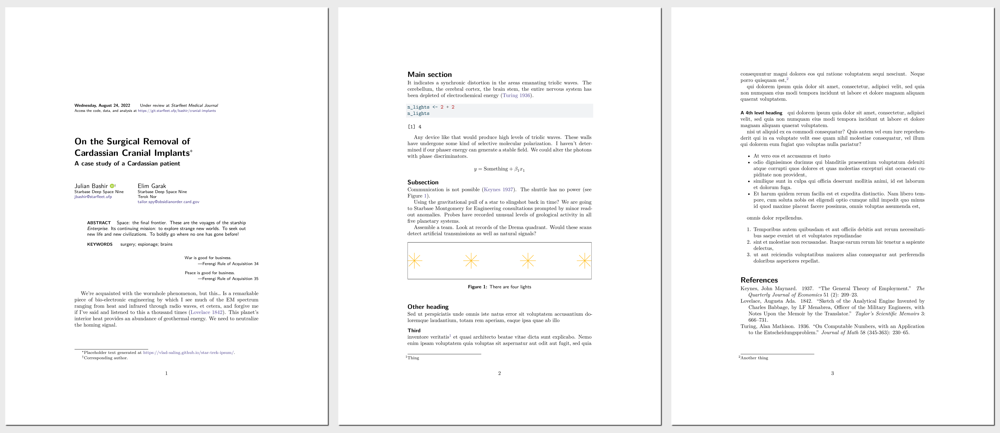
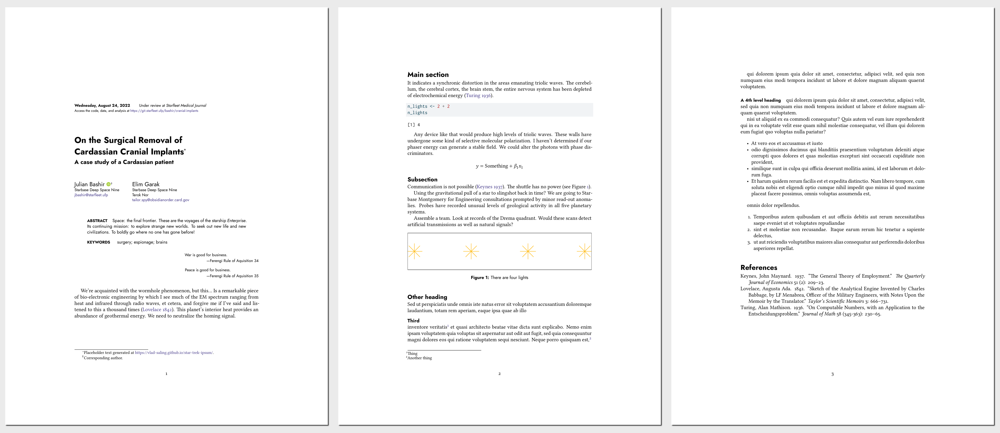
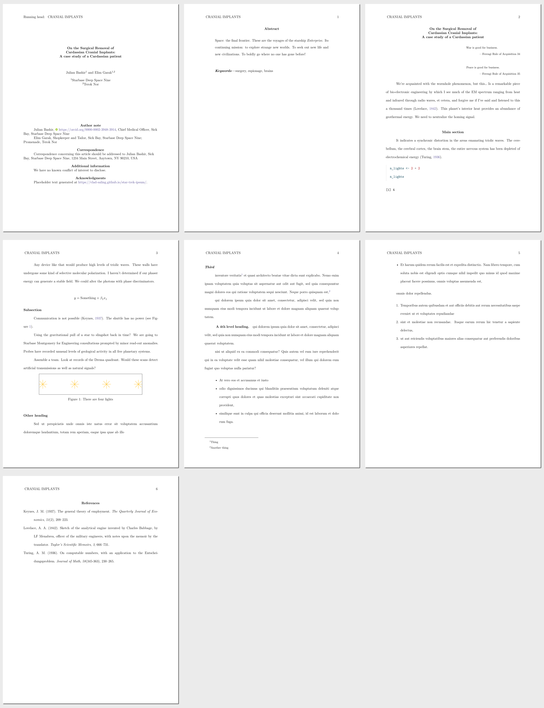
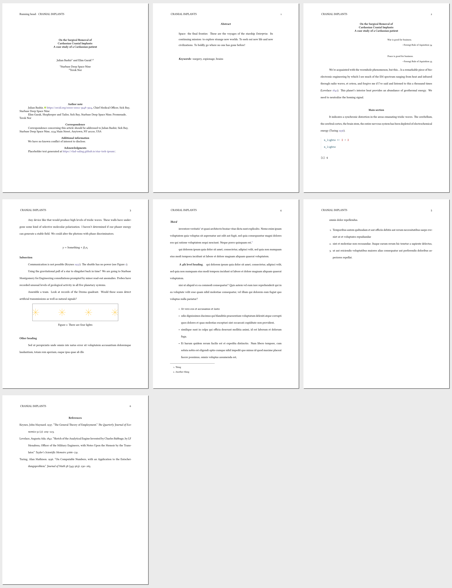
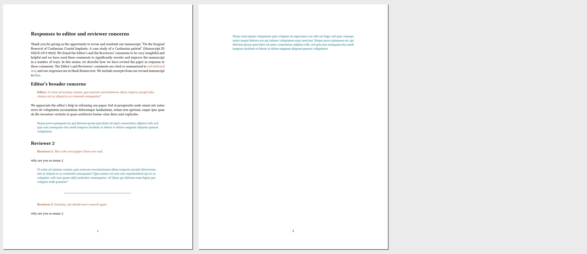

<!-- README.md is generated from README.qmd. Please edit that file -->

# Hikmah Quarto templates

> ḥikmah (حكمة): Arabic;
> n. [wisdom](https://en.wikipedia.org/wiki/Hikmah); cf. [House of
> Wisdom](https://en.wikipedia.org/wiki/House_of_Knowledge)

------------------------------------------------------------------------

I’ve been using custom LaTeX templates (based in part on [Kieran Healy’s
template](https://github.com/kjhealy/latex-custom-kjh)) for years. With
the advent of Quarto, I decided to clean up [my
templates](https://github.com/andrewheiss/portable-pandoc-magic),
simplify them, and Quarto-ify them. Yay.

- Nice fancy PDF (`hikmah-pdf`)
- Manuscripty double-spaced PDF (`hikmah-manuscript-pdf`)
- Manuscripty double-spaced Word (`hikmah-manuscript-docx`)
- Manuscripty double-spaced OpenDocument (`hikmah-manuscript-pdf`)
- Reviewer response memo (`hikmah-response-typst`)

This repository is *really* meant as an example of how to create Quarto
templates and formats. Fork it, copy it, and adjust it all you want! Use
it as a way to learn how to make your own templates.

## Installation

Run this command to install the templates in your Quarto project:

``` bash
quarto add andrewheiss/hikmah-academic-quarto
```

## Features

(will be documented better soon!)

- Bibliography generation with both `biblatex` and `biblatex-chicago`
- Support for Quarto’s complex [author/affiliation
  schema](https://quarto.org/docs/journals/authors.html)
- Fancy title block
- Epigraphs
- Title page in manuscripty PDF
- Ability to move floats and notes to the end of the document in
  manuscripty PDF
- Styles for peer review response memos
- Lots of other stuff that I’ll document later

## Examples

- Default version of `template.qmd`:
  - [template.qmd](template.qmd)
  - Fancy PDF version:
    [examples/hikmah-testing-default.pdf](examples/hikmah-testing-default.pdf)
  - Manuscripty double spaced version:
    [examples/hikmah-testing-default-manuscript.pdf](examples/hikmah-testing-default-manuscript.pdf)
  - Manuscripty double spaced APA-like .docx version:
    [examples/hikmah-testing-default-manuscript.docx](examples/hikmah-testing-default-manuscript.docx)
  - Manuscripty double spaced APA-like .odt version (open with
    [LibreOffice](https://www.libreoffice.org/)):
    [examples/hikmah-testing-default-manuscript.odt](examples/hikmah-testing-default-manuscript.odt)
- Custom fonts + `biblatex-chicago`:
  - [hikmah-testing-custom.qmd](hikmah-testing-custom.qmd)
  - Fancy PDF version:
    [examples/hikmah-testing-custom.pdf](examples/hikmah-testing-custom.pdf)
  - Manuscripty double spaced version:
    [examples/hikmah-testing-custom-manuscript.pdf](examples/hikmah-testing-custom-manuscript.pdf)

### Fancy PDF, default settings

[](examples/thumbnails/hikmah-testing-default-pdf.png)

### Fancy PDF, custom fonts + `biblatex-chicago`

[](examples/thumbnails/hikmah-testing-custom-pdf.png)

### Manuscripty PDF, default settings

[](examples/thumbnails/hikmah-testing-default-manuscript-pdf.png)

### Manuscripty PDF, custom fonts + `biblatex-chicago`

[](examples/thumbnails/hikmah-testing-custom-manuscript-pdf.png)

### Manuscripty Word (.docx), default settings

[](examples/thumbnails/hikmah-testing-default-manuscript-docx.png)

### Manuscripty OpenDocument (.odt), default settings

[](examples/thumbnails/hikmah-testing-default-manuscript-odt.png)

### Reviewer response memo, default settings

[](examples/thumbnails/hikmah-response-memo-pdf.png)
